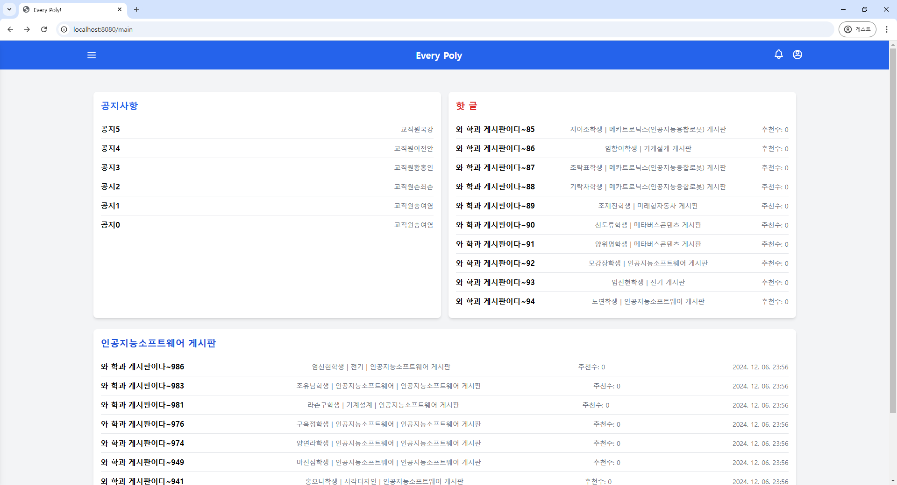

# Every Poly 프로젝트

## 📅 프로젝트 개요

- **프로젝트명:** Every Poly
- **진행 기간:** 2024년 10월 20일 ~ 2024년 12월 12일
- **프로젝트 유형:** 기말 과제
- **주요 기술 스택:**
    - **Backend:** Spring Boot, JPA, Spring Security, Thymeleaf
    - **Frontend:** Thymeleaf, HTML/CSS/JavaScript
    - **Database:** Oracle Database (OJDBC)
    - **기타:** Lombok, JUnit, Spring Security Test

---

## 🔧 Dependencies
- **JPA**: Spring Data JPA
- **Security**: Spring Security
- **Thymeleaf**: Thymeleaf
- **Web**: Spring Web
- **Thymeleaf Extras**: Thymeleaf Spring Security Integration
- **Lombok**: Lombok
- **Devtools**: Spring Boot DevTools
- **Oracle JDBC**: Oracle Database JDBC Driver
- **Junit**: JUnit Platform Launcher
- **Spring Boot Test**: Spring Boot Testing
- **Spring Security Test**: Spring Security Testing
---

## 🚀 주요 구현 방법

### **메인페이지** 🏠
- **REST API**를 활용해 메인페이지 구현
- 동적으로 메인페이지가 변경되도록 구현
- **JPA 쿼리**를 이용해 메인페이지에 표시될 게시글을 각 영역에 맞게 출력

---

### **전체 게시글 조회** 📃
- **JPA**를 이용해 전체 게시물을 조회
- **람다 함수**를 이용해 페이징 처리 구현

---

### **댓글 CRUD** 💬
- **REST API**를 활용해 댓글 기능 구현
- **댓글 조회**는 **JPA 쿼리**를 이용하여 페이징 처리 후 **REST API**로 반환

---

### **좋아요 기능** 👍
- **REST API**를 활용해 좋아요 기능 구현
- **로그인한 사용자**만 좋아요 기능 사용 가능

---

### **카테고리별 게시글 조회** 📂
- **카테고리별 공지**와 **게시물**을 구분하여 조회
- 카테고리별 공지사항을 최상단에 고정하여 출력
- **카테고리별 게시글**만을 조회해 출력

---

### **공지 조회** 📢
- 전체 공지사항만 조회하는 기능 구현
- 공지사항은 최상단에 고정되어 노출됨

---

### **로그인/회원가입** 🔐
- **Spring Security**를 활용한 로그인/회원가입 기능 구현
- 로그인한 사용자만 **CRUD 권한**을 가짐
- 비로그인 사용자는 **읽기 권한(Read only)**만 부여

---

### **권한 관리** 🛡️
- **로그인하지 않은 사용자**: Read 권한만 가능
- **로그인한 사용자**: 본인의 글에 대해 CRUD 권한 부여
- **Admin (관리자) 계급**: 모든 게시글에 대해 **삭제 권한** 및 **전체 공지 작성** 권한 보유
- **Manager (매니저) 계급**: **카테고리별 공지 작성** 권한 보유

---

### **관리자 기능** 🛠️
- **관리자(Admin)**는 모든 게시글에 대해 **삭제 권한**을 보유
- **전체 공지 작성** 권한 부여

---

### **매니저 기능** 📘
- **매니저(Manager)**는 **카테고리별 공지 작성** 권한 보유

---

### **좋아요/싫어요 기능** 👍👎
- 사용자는 특정 게시글에 **좋아요/싫어요**를 표시할 수 있음
- **로그인한 사용자**만 이용 가능
- **좋아요/싫어요** 상태는 **LikeDislike 엔티티**에 기록됨

---

### **댓글 기능** 💬
- **REST API**로 댓글 기능 구현
- 댓글 작성, 수정, 삭제, 조회 기능을 제공 (CRUD)
- **JPA 쿼리**를 통해 페이징 처리 후 **REST API**로 반환

---

### **회원 관리** 🧑‍🤝‍🧑
- 회원 정보 조회 및 관리 기능 제공
- **회원 CRUD** 기능 구현 (회원 추가, 조회, 수정, 삭제)
- **Spring Security**를 이용한 **비밀번호 암호화** 적용

---

## 📘 Entity 설계

### 1. **Board**
- **id** (Long) - PK, 자동 생성
- **title** (String) - 글 제목
- **content** (String) - 글 내용
- **likes** (Integer) - 좋아요 수
- **disLikes** (Integer) - 싫어요 수
- **allNotice** (Boolean) - 전체 공지 여부
- **departmentNotice** (Boolean) - 부서 공지 여부
- **member** (Member) - 작성자 정보 (ManyToOne 관계)
- **major** (Major) - 전공 정보 (ManyToOne 관계)

---

### 2. **LikeDislike**
- **id** (Long) - PK, 자동 생성
- **member** (Member) - 좋아요/싫어요를 남긴 사용자 (ManyToOne 관계)
- **board** (Board) - 좋아요/싫어요를 받은 게시글 (ManyToOne 관계)
- **likeStatus** (Boolean) - 좋아요/싫어요 상태 (true: 좋아요, false: 싫어요)

---

### 3. **Major**
- **id** (Integer) - PK, 자동 생성
- **name** (String) - 전공 이름 (고유, NULL 불허)

---

### 4. **Member**
- **id** (Long) - PK, 자동 생성
- **name** (String) - 사용자 이름
- **email** (String) - 이메일 (고유, NULL 불허)
- **nickname** (String) - 닉네임 (고유, NULL 불허)
- **phone** (String) - 전화번호 (고유, NULL 불허)
- **password** (String) - 비밀번호
- **address** (String) - 주소
- **major** (Major) - 전공 정보 (ManyToOne 관계)
- **role** (Role) - 사용자 역할 (ADMIN, MANAGER, USER)
- **position** (Position) - 사용자 직위

---

### 5. **Reply**
- **id** (Long) - PK, 자동 생성
- **content** (String) - 댓글 내용
- **board** (Board) - 해당 댓글이 작성된 게시글 (ManyToOne 관계)
- **member** (Member) - 댓글 작성자 정보 (ManyToOne 관계)

---

## 📋 주요 기능
1. **전체글 조회**: 모든 공지를 조회하여 최상단에 검색 내용을 표시
2. **카테고리 별 조회**: 모든 공지를 조회하고, 카테고리 공지사항과 카테고리 게시물만 조회
3. **공지 조회**: 전체 공지만 조회
4. **댓글 조회**: 게시글에 대한 댓글 조회 기능

---

## 🔐 권한 관리
- **로그인하지 않은 사용자**: Read 권한만 가능
- **로그인한 사용자**: CRUD 권한 가능 (자신의 글에 한하여 수정 및 삭제 가능)
- **Admin (관리자) 계급**: 모든 글에 대한 삭제 권한 및 전체 공지 작성 권한
- **Manager (매니저) 계급**: 카테고리 별 공지 작성 권한
